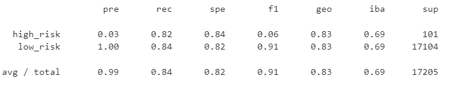
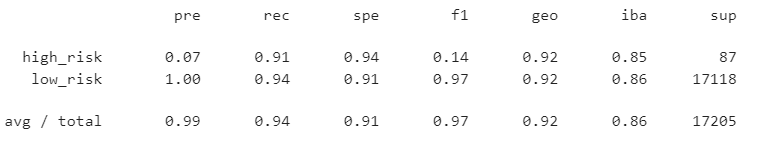

# Credit_Risk_Analysis

## Overview of the analysis

Using data from [LendingClub](https://ir.lendingclub.com/home/default.aspx), an analysis of the data was made about am issue of unbalanced classifcations of good loans to risky loans.  The data needed to be resampled and trained to make more accurate predictions on loans via Machine Learning.

Original data sent had 115,675 loan applications in Q1 of 2019.  In using Loan Status, we were about to see what was low risk compared to high risk.  When the datas set was cleaned and reduced, the data was brought down to 51,366 with a still a large majority showing low risk.  

Multiple methods were employed to train, test and fit the data to make better comparison models.

## Results

* Oversampling RandomOverSampler Model: instances of the minority class are randomly selected and added to the training set until the majority and minority classes are balanced. 

  

* Balanced Random Forest Classifer :A balanced random forest randomly under-samples each boostrap sample to balance it.

  

* SMOTE (Synthetic Minority Oversampling Technique) Model :  like random oversampling, the size of the minority is increased. The key difference between the two lies in how the minority class is increased in size.

  

* SMOTEENN algorithm (Synthetic Minority Oversampling Technique + Edited NearestNeighbors)): SMOTEENN combines the SMOTE and Edited Nearest Neighbors (ENN) algorithms. SMOTEENN is a two-step process:

    1. Oversample the minority class with SMOTE.
    2. Clean the resulting data with an undersampling strategy. If the two nearest neighbors of a data point belong to two different classes, that data point is dropped.

  

* Undersampling ClusterCentroids Model : Cluster centroid undersampling is akin to SMOTE. The algorithm identifies clusters of the majority class, then generates synthetic data points, called centroids, that are representative of the clusters. The majority class is then undersampled down to the size of the minority class.

  

* Ensemble Classifiers : Ensemble learning is a way of generating various base classifiers from which a new classifier is derived which performs better than any constituent classifier .

  

## Summary
After exploring all various methods and algorithms, I recommend the Ensemble Classifier as it had the highest accuracy rating for this particular dataset.  I would recommend that datasets be put through a few different models before deciding on what works for that particular dataset, as it may vary based on the information provided.