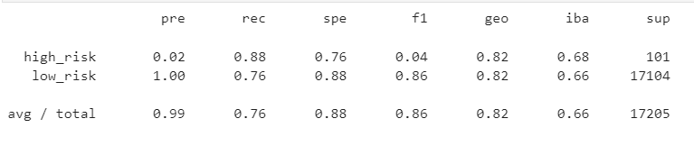

# Credit_Risk_Analysis

## Overview of the analysis

Using data from [LendingClub](https://ir.lendingclub.com/home/default.aspx), an analysis of the data was made about am issue of unbalanced classifcations of good loans to risky loans.  The data needed to be resampled and trained to make more accurate predictions on loans via Machine Learning.

Original data sent had 115,675 loan applications in Q1 of 2019.  In using Loan Status, we were about to see what was low risk compared to high risk.  When the datas set was cleaned and reduced, the data was brought down to 51,366 with a still a large majority showing low risk.  

Multiple methods were employed to train, test and fit the data to make better comparison models.

## Results

* Oversampling RandomOverSampler Model

  

* BalancedRandomForestClassifer

  

* SMOTE (Synthetic Minority Oversampling Technique) Model

* SMOTEENN algorithm (Synthetic Minority Oversampling Technique + Edited NearestNeighbors))

  

* Undersampling ClusterCentroids Model

* Ensemble Classifiers

 

## Summary
After exploring all various methods and algorithms, I recommend the Ensemble Classifier as it had the highest accuracy rating for this particular dataset.  I would recommend that datasets be put through a few different models before deciding on what works for that particular dataset, as it may vary based on the information provided.